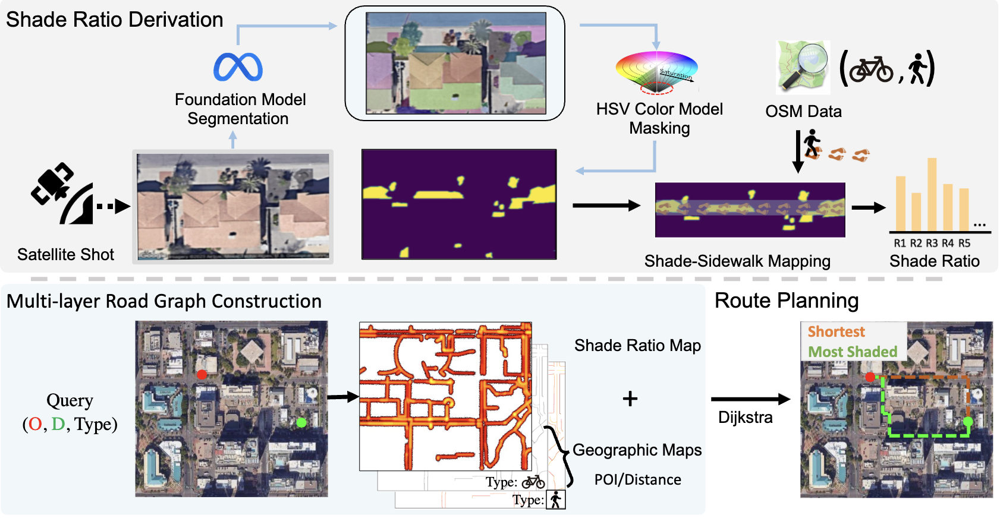

# Shaded_planning

## This is the frontend of the project shaded planning

This project intends to design a prototype of shade route planning with Satellite Image Segmentation. The purpose if to help users better plan their outdoor itineraries with most comfortable sunlight exposure situation.

The project is deploy online: 

http://18.191.152.144:9999/tutorial.html

The overview of the designed pipline is shown here:

The detailed pipeline includes three components: Shade Ratio Derivation, Multi-
layer Road Graph Construction, and Route Planning Interface.

## How to run the front-end:

Make sure to have a server to host the frontend. For developmet purposes, a http server from the python 3 was used.
1. Move to frontenf folder by running the command: cd frontend
2. To start the server, run the command: python3 -m http.server 3000
3. Open Chrome/any other browser, and go to URL: http://localhost:3000
4. Enter Google Maps API Key, source and destiantion address, Click on Search

## How to run the back-end:

Before start running the backend server, make sure you have the following packages installed:
1. install node.js
2. npm install cors
3. npm i

Then, you should have the following adjustment:

> Make sure to change the script Path in Server/app.js
> Change the pkl_filename in the Dijkstra_shaded.py
> Change the links_file_path and node_file_path in the end of Dijkstra_shaded.py
> cd to the path of node.js, then run: node app.js